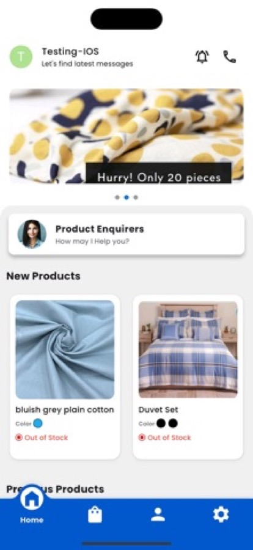
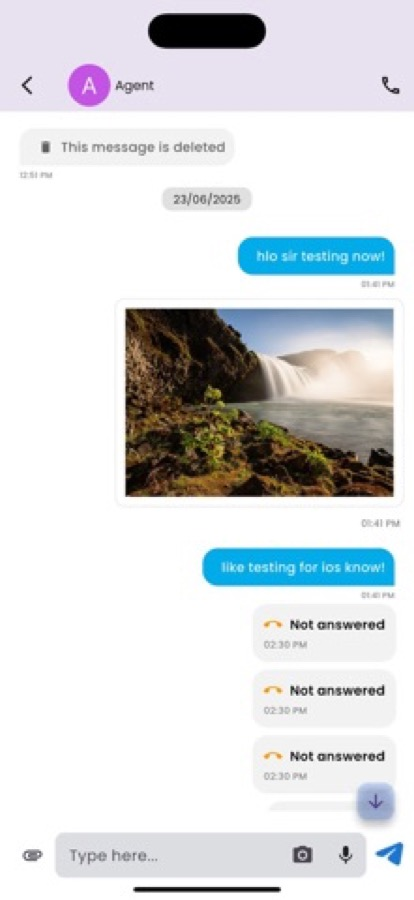
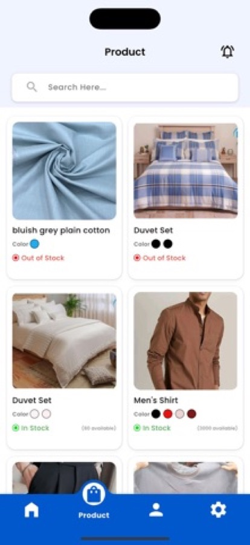
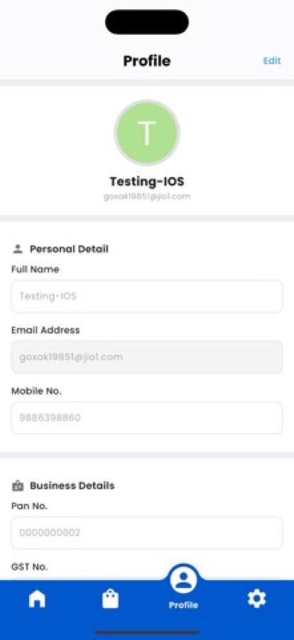
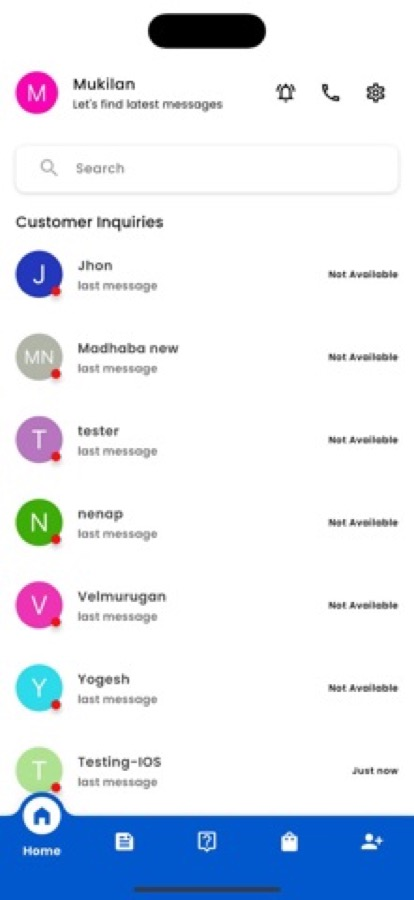

# KKP Group App

Marketplace app for KKP Group's textile business: customers browse and order, agents handle enquiries over real-time chat and calls, admins manage users, catalogue and marketing. Live on the Play Store and the App Store.

<p>
  
  
  
  
  
</p>
<p><a href="https://apps.apple.com/in/app/kkp-group/id6748518075">App Store</a> · <a href="https://play.google.com/store/apps/details?id=com.kkptextile.kkpchatapp">Play Store</a></p>

## Features
- Three roles in one app (admin, agent, customer) with role-based navigation and screens
- Real-time chat over Socket.IO with images, files and voice notes, cached locally in Hive so history survives restarts and reconnects
- Voice calls with Agora; incoming calls ring natively on iOS through CallKit (platform channel) and on Android through a full-screen call UI, signalled by FCM when the app is in the background or killed
- Push and local notifications that open the right chat
- Media uploads to AWS S3 with on-device image compression
- Phone-number sign-in with OTP, meeting scheduling with a calendar, admin dashboards with charts and Excel export
- Multiple languages via flutter_localizations

## Stack
Flutter 3.x · Dart ^3.6 · Provider · REST (`http`) + Socket.IO · Firebase Core + Messaging · Agora RTC · flutter_callkit_incoming · Hive · AWS S3 · flutter_dotenv

## Run it
```bash
git clone https://github.com/QuantumSharqwebteam/kkp_chat_app.git
cd kkp_chat_app
flutter pub get
flutter run
```
Config: create `.env` with `BASE_URL`, `SOCKET_IO_URL`, `AGORA_APP_ID`, `AWS_BUCKET_NAME`. Firebase needs your own `google-services.json` and `GoogleService-Info.plist`.

## What was hard
Incoming calls when the app is killed. iOS will not wake a Flutter app for a socket event, so the call signal travels as an FCM push that the native side turns into a CallKit ring before Flutter is running; the Dart layer joins the Agora channel only when the user answers. Keeping chat history consistent across socket reconnects and app restarts meant merging server history with the Hive cache instead of trusting either one. Details in `docs/CALLKIT_IMPLEMENTATION_GUIDE.md` and `docs/chat_screen_architecture.md`.

## Status
Production · maintained · Last updated June 2026

## Licence
Company code, published for reference. All rights reserved.
